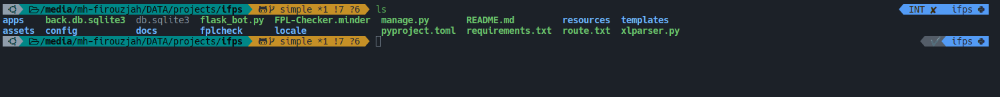

# Zsh Configuration

This is a custom Zsh configuration that includes a variety of useful features and customizations.

It's designed to work on Linux and macOS systems and can be easily installed and customized to suit your needs.

Also it is inspired by `mankaro-zsh-configuration` but it supports all Linux Distributions. The following is screenshot of Kubuntu terminal:



## Features

Some of the notable features included in this configuration are:

- A custom prompt that includes `Git integration` and the ability to display the current `Python virtual environment`.
- A variety of useful aliases and functions, including shortcuts for common commands like `ls`, `cd`, and `grep`.
- Auto-completion for many common commands and options.
- Syntax highlighting for commands and file types.
- Suggestion to install possible packages on command not found situations.

## Installation

### Preparations

- Install required packages
  - Arch Linux

    ```sh
    sudo pacman -S pkgfile
    ```

    - Update `pkgfile` database so to be able to recommend packages

      ```sh
      pkgfile -u
      ```

  - Debian/Ubuntu

    ```sh
    sudo apt install command-not-found
    ```

### Automatic Installation

- Use the command bellow:

  ```sh
  bash <(curl -s https://raw.githubusercontent.com/mh-firouzjah/zsh-config/master/install.sh)
  ```

### Manual Installation

To install this configuration manually, follow these steps:

- Clone required repositories to your home directory

  ```sh
  git clone https://github.com/mh-firouzjah/zsh-config.git ~/.zsh
  git clone --depth=1 https://github.com/romkatv/powerlevel10k.git ~/.zsh/plugins/powerlevel10k
  git clone https://github.com/zsh-users/zsh-autosuggestions ~/.zsh/plugins/zsh-autosuggestions
  git clone https://github.com/zsh-users/zsh-completions ~/.zsh/plugins/zsh-completions
  git clone https://github.com/zsh-users/zsh-history-substring-search ~/.zsh/plugins/zsh-history-substring-search
  git clone https://github.com/zsh-users/zsh-syntax-highlighting.git ~/.zsh/plugins/zsh-syntax-highlighting
  ```

- Copy the `.zshrc` file to your home directory

  ```sh
  cp ~/.zsh/.zshrc ~/.zshrc
  ```

### Finally

- Restart your terminal or run `source ~/.zshrc` to apply the changes.

### Exception

- If powerlevel10k is asking for and generating a new prompt interface
different from what is manjaro's default zsh theme,
copy `./p10k.zsh` to the home directory of appropriate user.

  ```sh
  cp ~/.zsh/modules/p10k.zsh ~/.p10k.zsh
  ```

- If your terminal does not support `p10k.zsh` try:

  ```sh
  cp ~/.zsh/modules/p10k-portable.zsh ~/.p10k.zsh
  ```

## Customization

This configuration can be easily customized to suit your needs. Simply edit the .zshrc file to add or modify
aliases, functions, or other settings.

You can also add additional files to the zsh-config directory and source them from the .zshrc file.

## License

This project is licensed under the MIT License - see the LICENSE file for details.

## Acknowledgments

This configuration is based on the work of talented developers and contributors in the Zsh community.
Special thanks to [Chrysostomus ↗](https://github.com/Chrysostomus/manjaro-zsh-config)
for the original manjaro-zsh-config project that inspired this configuration.
